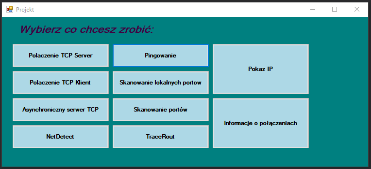

# Conenction TCP/IP
This project I made for university and I imporve it. It simulates us a few typical network funtion. You can choose one option and see how it's working. App was writen using WPF. 
## Content
1. [ Technologies. ](#tech)
2. [ How to open. ](#open)
3. [ Screenshoots. ](#ss)
4. [ Main Features. ](#main)

## 1. Technologies:

* C#
* WPF

## 2. How to open a project?

* Downolad the package  
* Open solution 
* CTRL+ F5
* Or just go and open .exe file

## 3. Screenshoots

First look at app

Details about one subject

Adding a new subject. This app has little security :).

You can login into this.

And also you can add a new session.

## 4. Main Features
* Showing any information about connection 
* Checking IP adress
* Checkinh connection in others computers
* TracRoute, NetDetect
## Status
Project is finished

## Contact

Dawid Baron || dawidbaron4@gmail.com
* [github ](https://github.com/dawidbaron)
* [linkedin ](https://www.linkedin.com/in/dawid-baron-925a67183/)

